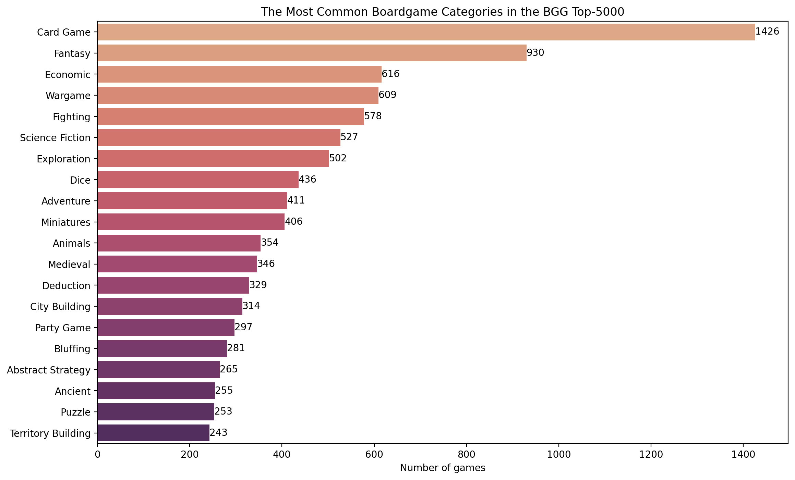

# BGG-boardgame-analysis
Exploratory Analysis of the Boardgamegeek.com (aka BGG) Top-5000 Board games.
Board game names, ratings, weights + several other features were scraped using the BGG API. The resulting data was cleaned and some light exploratory data analysis was performed. I was particularly curious to see how the number of games published, their weight, and the most popular categories have changed over time. I also wanted to get a rough idea about the key ingredients for a good board game today using an appropriate regression model. Here are some findings that I thought were interesting.

**1. About 99% of the board games in the BGG top-5000 were published after 1970 with a dramatic increase starting in the late 90s/early 2000s.**

**2. There was a lot of fluctuation in the average board game weight from 1980 to 2020 but the overall trend was for games to get lighter. Since 2020 there's been a shift towards heavier board games.**

**3. A correlation matrix shows a positive correlation between game weight and its average rating/Bayes average rating (which accounts for the number of users who rated the game penalizing the games with few ratings).**

**4. Card games are the largest category in the BGG Top-5000 followed by 'Fantasy', 'Economic' and 'Wargame'.**

**5. Different war-themed categories also seem to have high average ratings but very low Bayes average ratings because fewer users rate them.**

**6. Also, wargames tend to be the heaviest.**

**7. Some of the game mechanics associated with highly rated board games are: 'Legacy Game', 'Automatic Resource Growth', and 'Delayed Purchase'**

**8. Finally, looking at the most common board game categories from pre-1980 to 2020s reveals the fall in popularity of wargames and the rise of fantasy and dice games**

